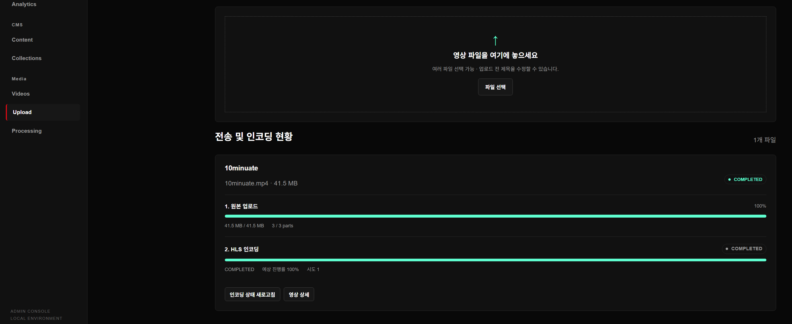
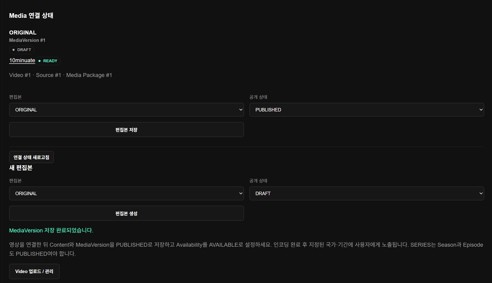
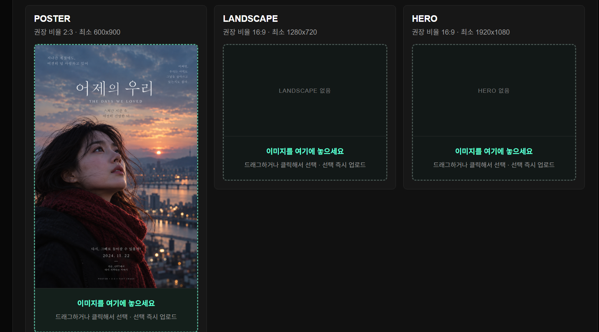
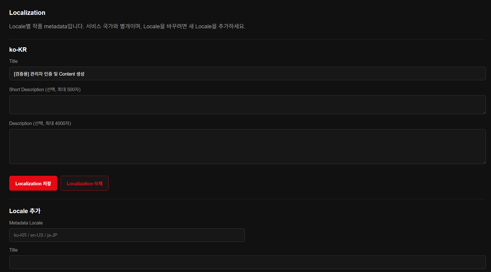
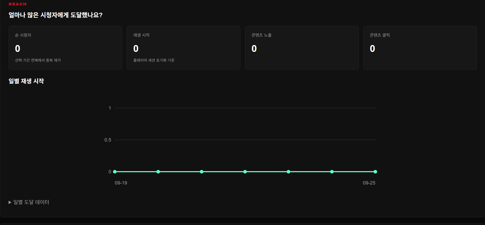
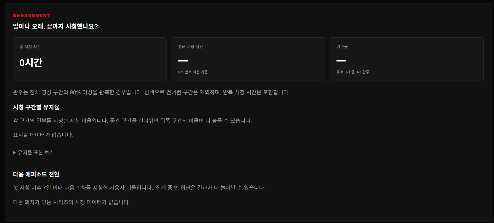
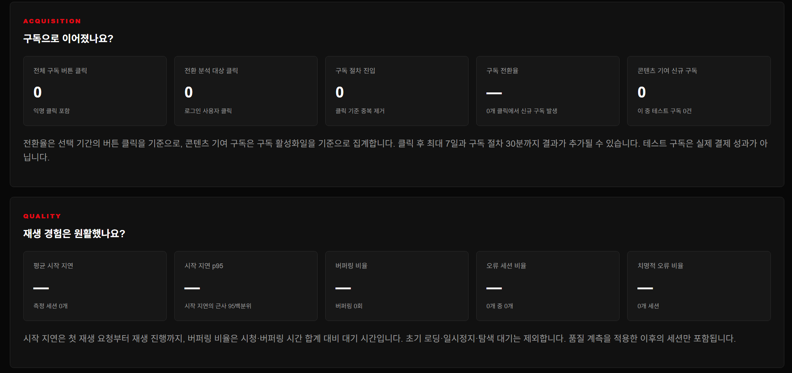
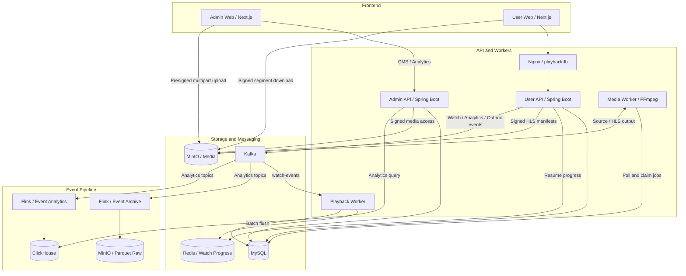
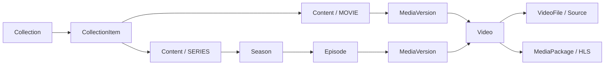

# OTT Service

**콘텐츠 등록부터 영상 인코딩, 사용자 재생, 시청 데이터 분석까지 연결한 OTT 서비스 포트폴리오입니다.**

운영자는 Admin CMS에서 작품·영상·노출 정책을 관리하고, 사용자는 공개된 콘텐츠를 HLS로 시청합니다. 재생과 행동 이벤트는 Kafka를 거쳐 원본 보관과 분석 경로로 분리되며, 집계 결과는 관리자 대시보드에서 확인할 수 있습니다.

DAU 100만 규모의 글로벌 OTT를 설계 시나리오로 삼아, **도메인 분리·비동기 처리·재시도 시 정합성·장애 복구**에 초점을 맞췄습니다. 해당 규모의 처리 성능을 달성했다는 의미는 아니며, 현재 구현과 검증 범위는 아래에 구분해 정리했습니다.

[주요 화면](#features) · [아키텍처](#architecture) · [설계 포인트](#design) · [검증과 범위](#verification) · [실행 방법](#run) · [상세 문서](#documents)

## 한눈에 보는 기능

| 영역 | 구현한 기능 |
| --- | --- |
| 콘텐츠 운영 | 영화·시리즈, 시즌·에피소드, 편집본, 다국어 제목·설명, 아트워크, 컬렉션 관리 |
| 공개 정책 | 작품·편집본 공개 상태와 국가·기간별 Availability를 조합한 노출 및 재생 제어 |
| 영상 처리 | Multipart 업로드, 비동기 FFmpeg HLS 인코딩, 처리 상태 확인, 관리자 미리보기 |
| 사용자 시청 | 콘텐츠 목록, 로그인, 재생 세션, 서명 URL 기반 HLS 재생, 시청 기록·이어보기 |
| 데이터 파이프라인 | 이벤트 Batch 수집, Kafka 발행, Flink 원본 보관·분석, ClickHouse 조회 |
| 운영 분석 | 도달, 시청 시간·완주율·유지율, 구독 전환, 시작 지연·버퍼링·오류 지표 |

<a id="features"></a>

## 주요 화면과 기능

아래 이미지는 로컬 관리자 화면입니다. 분석 화면의 `0`과 `—`는 조회 기간에 데이터 또는 측정 표본이 없는 상태이며, 실제 서비스 운영 성과를 나타내지 않습니다.

### 1. 영상 업로드부터 HLS 인코딩까지



여러 영상 파일을 선택하거나 드래그하여 등록하고, **원본 업로드와 HLS 인코딩을 별도 단계로 확인**합니다. 업로드 용량·완료된 Part 수·인코딩 상태·시도 횟수를 표시해 운영자가 처리 중인 단계를 구분할 수 있습니다.

브라우저는 발급받은 서명 URL로 원본을 MinIO에 직접 업로드합니다. 업로드 완료 후 별도 Media Worker가 인코딩을 수행하므로, 긴 영상 처리 작업을 API 요청 안에서 기다리지 않습니다.

### 2. 작품과 실제 영상의 연결



사용자가 보는 **작품(Content)**, 원본·편집본을 구분하는 **MediaVersion**, 실제 재생 자산인 **Video**를 분리했습니다. 영화는 작품에, 시리즈는 에피소드에 편집본과 영상을 연결합니다.

영상이 `READY`여도 작품이 자동으로 공개되지는 않습니다. 작품·편집본의 `PUBLISHED` 상태와 국가·기간별 `AVAILABLE` 조건을 함께 만족해야 사용자에게 제공되며, 시리즈는 시즌·에피소드의 공개 상태도 확인합니다.

### 3. 용도별 아트워크 관리



세로 포스터(`POSTER`), 가로 카드(`LANDSCAPE`), 대형 배너(`HERO`)를 구분해 등록합니다. 각 영역에 권장 비율과 최소 해상도를 안내하고, 드래그 또는 파일 선택으로 업로드한 결과를 미리 봅니다. 에피소드 이미지는 별도의 `THUMBNAIL`로 관리합니다.

이미지는 작품 메타데이터와 별도 자산으로 관리하며, 저장소에는 파일을, DB에는 접근 URL 대신 `objectKey`를 저장합니다.

### 4. 다국어 메타데이터와 국가별 서비스 정책



`ko-KR`, `en-US`, `ja-JP` 등의 Metadata Locale별로 제목과 설명을 관리합니다. **콘텐츠를 어떤 언어로 설명하는지와 어느 국가에서 서비스하는지를 분리**하여, 번역을 추가하는 작업이 서비스 가능 국가를 바꾸지 않도록 했습니다.

이미지는 Localization 화면이며, 국가·기간별 공개 조건은 별도의 Availability에서 설정합니다. 현재 사용자 국가 판별은 서버의 `CATALOG_COUNTRY` 설정을 사용합니다.

### 5. 콘텐츠 도달 분석 — Reach



선택한 작품과 기간의 순 시청자, 재생 시작, 콘텐츠 노출·클릭, 일별 추이를 확인합니다. 순 시청자는 일별 수치를 더하지 않고 **조회 기간 전체에서 중복 제거**합니다. 재생 시작과 순 시청자는 플레이어 세션 초기화 관측 기준입니다.

### 6. 시청 몰입도 분석 — Engagement



총·평균 시청 시간, 완주율, 시청 구간별 유지율, 다음 에피소드 전환을 제공합니다. 완주는 영상 구간의 **90% 이상이 관측된 경우**로 정의하고, 탐색으로 건너뛴 구간은 제외합니다. 다음 회차 전환은 첫 시청 후 7일 이내의 시청을 기준으로 합니다.

지표 옆에 집계 기준과 표본 정보를 표시해 숫자의 의미를 함께 전달합니다.

### 7. 구독 전환과 재생 품질 — Acquisition · Quality



구독 버튼 클릭 → 구독 절차 진입 → 구독 활성화 흐름을 분석하고, 콘텐츠가 신규 구독에 기여했는지 확인합니다. 현재 구독 활성화는 로컬 테스트 경로이며 테스트 구독을 별도로 표시합니다.

재생 품질은 평균·p95 시작 지연, 버퍼링 비율, 오류·치명적 오류 세션 비율로 확인합니다. 표본이 없는 비율은 `—`로 표시하며, 분석 서버 장애는 정상적인 0건과 구분해 오류로 안내합니다.

<a id="architecture"></a>

## 시스템 아키텍처

현재 로컬 Compose 구성과 주요 데이터 흐름입니다. 초기화 컨테이너와 인증 세부 경로는 생략했습니다.



- **콘텐츠·미디어 경로:** Admin API가 메타데이터와 처리 작업을 저장하고, Media Worker가 MySQL 작업을 선점해 HLS를 생성합니다. 인코딩 작업은 DB 폴링 방식입니다.
- **시청 경로:** User API가 재생 가능 여부와 세션을 확인합니다. 브라우저는 서명된 미디어 URL로 저장소에서 세그먼트를 내려받고, 이어보기 이벤트는 `watch-events → Playback Worker → Redis → MySQL` 경로로 반영합니다.
- **분석 경로:** `playback-events`, `behavior-events`, `subscription-events`를 독립된 Flink Archive와 Analytics가 소비합니다. 원본은 MinIO Parquet로 보관하고, 분석 결과는 ClickHouse를 통해 조회합니다.

### 도메인 구조



콘텐츠를 편성·번역·공개하는 책임과, 파일을 업로드·인코딩·재생하는 책임을 나눴습니다. 컬렉션의 노출 단위도 영상 파일이나 시즌이 아닌 작품으로 유지합니다.

### 기술 스택

| 계층 | 기술 | 사용 목적 |
| --- | --- | --- |
| Frontend | Next.js 16, React 19, TypeScript, Tailwind CSS 4, hls.js | Admin CMS, 사용자 화면, HLS 플레이어 |
| API | Java 21, Spring Boot 4.1, Spring Security, JPA·JDBC | 인증, 콘텐츠 정책, 재생 세션, 업로드 제어 |
| Media | FFmpeg, FFprobe, MinIO / S3 API | 원본 분석, HLS 변환, 파일 저장·서명 접근 |
| Persistence | MySQL 8, Redis 7.2 | 서비스 데이터, 시청 진행 상태와 배치 반영 |
| Event | Kafka 3.7, Flink 1.20 | 비동기 이벤트 전달, 원본 보관, 분석 처리 |
| Analytics | ClickHouse 25.8, Parquet | 분석 조회와 원본 이벤트 보존 |
| Local runtime | Docker Compose, Nginx, Gradle, pnpm | 전체 환경 재현, API 프록시, 모노레포 빌드 |

Flink 모듈은 JDK 21로 빌드하되 Flink 런타임에 맞춰 Java 17 바이트코드를 생성합니다.

<a id="design"></a>

## 핵심 설계 포인트

| 해결하려는 문제 | 구현한 선택 | 고려한 비용과 한계 |
| --- | --- | --- |
| 대용량 업로드와 인코딩이 API 요청을 오래 점유 | Presigned Multipart 업로드와 별도 Media Worker | 업로드 완료 검증, 미완료 업로드 정리, 작업 상태 관리 필요 |
| 재시도·Worker 중복 실행이 기존 결과를 덮어씀 | 업로드 Idempotency-Key, 작업 `SKIP LOCKED` 선점, lease·generation·worker 검증 | 임대 만료 복구와 오래된 Worker 결과 차단 로직 필요 |
| 빈번한 시청 진행 이벤트가 DB 쓰기로 직결 | Kafka 소비 후 Redis에 진행 상태 반영, MySQL 배치 flush | 비동기 반영 지연과 Redis 상태 복구 범위 고려 필요 |
| 구독 상태 변경과 이벤트 발행 사이의 불일치 | 같은 DB 트랜잭션에 상태와 Outbox 저장 후 Kafka로 전달 | 재발행 가능성을 전제로 소비 측 중복 처리 필요 |
| 분석 장애가 원본 수집까지 중단 | Archive와 Analytics의 Flink 작업·consumer group·checkpoint 분리 | 별도 작업 운영과 복원 지점 관리 필요 |
| 이벤트 재전송이 지표를 부풀림 | ClickHouse ReplacingMergeTree와 `FINAL` 기반 중복 제거 조회 | 조회 시 중복 제거·집계 비용이 있어 규모별 성능 측정 필요 |
| 공개 기간이 지난 콘텐츠에 계속 새 재생 요청 | 목록·재생 세션·HLS playlist 요청에서 서비스 조건 검사 | 이미 발급된 서명 URL은 만료 전까지 유효 |

구현을 확인할 수 있는 대표 코드:

- [업로드 멱등성 처리](backend/admin-api/src/main/java/com/domain/backend/video/application/VideoUploadService.java)
- [인코딩 작업 선점](backend/media-worker/src/main/java/com/domain/backend/worker/job/MediaJobClaimService.java) · [Worker 결과 게시 검증](backend/media-worker/src/main/java/com/domain/backend/worker/process/MediaPackagePublisher.java)
- [시청 진행 상태 배치 반영](backend/playback-worker/src/main/java/com/domain/backend/playbackworker/WatchProgressFlushWorker.java)
- [구독 상태 변경과 Outbox 기록](backend/user-api/src/main/java/com/domain/backend/subscription/SubscriptionService.java)

<a id="verification"></a>

## 검증과 현재 범위

저장소에는 업로드·공개 정책·재생 권한·이벤트 수집·분석 projection·ClickHouse sink 등의 테스트와, 로컬 장애 복구 검증 기록이 있습니다.

| 검증 기록 | 확인한 내용 |
| --- | --- |
| [Archive 장애 복구](backend/event-archive/README.md) | 격리 환경에서 TaskManager·JobManager 중단 후 checkpoint 복원, 입력 9건의 원본 보존과 Kafka 위치 기준 중복 여부 확인 |
| [Analytics 재수집·장애 격리](backend/event-analytics/README.md) | 중복·비정상 이벤트 처리, 재수집 후 지표 유지, ClickHouse 중단 중 Archive 지속 및 복구 후 적재 재개 |
| [관리자 분석 API·화면](backend/event-analytics/ADMIN_UI.md) | 지표 정의, 인증·조회 제한, 빈 데이터와 장애 상태 구분, 검증 절차 |

위 결과는 각 문서에 기록된 로컬 검증 범위입니다. 현재 단일 Kafka broker·Flink JobManager 구성으로, 운영 환경의 고가용성이나 DAU 100만 부하를 입증하는 결과는 아닙니다.

현재 남아 있는 확장 과제는 다음과 같습니다.

- 실제 결제 연동과 사용자 국가 판별, 사용자 선호 Locale에 따른 메타데이터 선택.
- 부하 측정을 통한 병목 확인, 분석 사전 집계와 저장소 앞단 CDN 적용 검토.
- Kafka·Flink 운영 고가용성 구성, 장기 Raw 데이터를 이용한 backfill 실행 경로.

### 프로젝트 구조

```text
ott_service/
├─ frontend/apps/
│  ├─ admin-web/          # 관리자 CMS·콘텐츠 분석
│  └─ user-web/           # 사용자 카탈로그·플레이어
├─ backend/
│  ├─ admin-api/          # 콘텐츠 운영·미디어 관리·분석 조회
│  ├─ user-api/           # 사용자 인증·재생·이벤트 수집·구독
│  ├─ media-worker/       # 비동기 HLS 인코딩
│  ├─ playback-worker/    # 시청 이벤트 소비·진행 상태 저장
│  ├─ event-archive/      # Flink → MinIO Parquet 원본 보관
│  ├─ event-analytics/    # Flink → ClickHouse 분석
│  ├─ common/             # 공통 도메인·이벤트·영속성 코드
│  ├─ storage-s3/         # S3 호환 저장소 접근
│  └─ docker-compose.yml  # IDE 개발용 인프라·Worker
├─ docs/                  # 관리자 화면 캡처
└─ docker-compose.yml     # 전체 로컬 서비스
```

<a id="run"></a>

## 로컬 실행 가이드


### Content 등록부터 사용자 노출까지

1. Admin Web의 **Content → 생성**에서 작품을 만들고 상세 화면에서 제목(Localization)을 등록한다.
2. **Video 업로드 / 관리**에서 영상을 업로드한다. 인코딩 상태가 `READY`가 되어야 사용자에게 노출된다.
3. 영화는 Content 상세의 **Media**에서 편집본(예: `ORIGINAL`)을 만들고 **업로드한 Video**를 선택하여 연결한다. 시리즈는 Season/Episode를 만든 뒤 Episode 상세에서 연결한다.
4. Content와 MediaVersion을 `PUBLISHED`로 저장한다. 시리즈는 Season/Episode도 `PUBLISHED`로 설정한다.
5. **Availability**에서 서비스 국가와 시작·종료 시각(UTC)을 입력하고 `AVAILABLE`로 저장한다. 시작 시각은 포함하고 종료 시각은 제외한다. 종료를 비우면 무기한이다.
6. User Web 홈에서 현재 서비스 중인 작품을 확인한다. 연결되지 않은 업로드 영상은 노출되지 않는다. 시리즈는 첫 공개 에피소드로 연결된다.

로컬 서비스 국가는 `.env`의 `CATALOG_COUNTRY`(기본 `KR`)로 설정한다. 사용자 국가 판별은 아직 구현하지 않았으므로 조회와 재생 모두 동일한 서버 설정을 사용한다. 국가와 Metadata Locale은 별개이며 현재 작품 제목은 등록된 Locale 순서의 첫 제목을 사용한다.

`GET /api/public/contents`는 작품 단위 커서 페이지를 반환한다. 사용자 홈은 30초마다, 그리고 다시 포커스될 때 목록을 갱신한다. API는 매 요청마다 기간을 검사하므로 별도 예약 작업 없이 서비스 기간이 적용된다. 종료 후 새 재생 세션 및 HLS playlist 요청도 거부한다. 이미 내려받은 영상이나 발급된 미디어 서명 URL은 회수되지 않으며 기존 URL 만료 정책이 적용된다.

### 사전 준비

- Docker Desktop 및 JDK 21 (Gradle Wrapper로 Backend JAR 빌드)
- 저장소 루트에서 `.env.example`을 복사한 뒤 로컬 환경 값 입력

```powershell
# 저장소 루트에서 실행
copy .env.example .env
```

- 아래는 주요 변수 예시다. 전체 항목은 `.env.example`을 기준으로 설정하고, ClickHouse 분석용 `CLICKHOUSE_USER` / `CLICKHOUSE_PASSWORD`도 입력한다. 실제 값은 `.env`에서만 관리하고 커밋하지 않는다.
```
MYSQL_USER=ott
MYSQL_PASSWORD=change-me
MYSQL_ROOT_PASSWORD=change-me-root
MINIO_ROOT_USER=minioadmin
MINIO_ROOT_PASSWORD=change-me-minio
MINIO_CORS_ALLOWED_ORIGINS=http://localhost:3000,http://localhost:3001
STORAGE_PUBLIC_ENDPOINT=http://localhost:9000

ADMIN_USERNAME=admin
ADMIN_PASSWORD=change-me-admin

LOCAL_TEST_USER_ENABLED=false
LOCAL_TEST_USER_PASSWORD=
USER_ACCESS_TOKEN_SECRET=replace-with-at-least-32-random-characters
REDIS_HOST=localhost
REDIS_PORT=6379
KAFKA_BOOTSTRAP_SERVERS=localhost:9092
WATCH_EVENTS_TOPIC=watch-events
WATCH_EVENTS_DLQ_TOPIC=watch-events.dlq
WATCH_EVENTS_PARTITIONS=12
PLAYBACK_CONSUMER_GROUP=playback-progress-group

```

테스트 사용자 계정이 필요하면 env에 아래처럼 설정한다.

```text
LOCAL_TEST_USER_ENABLED=true
LOCAL_TEST_USER_PASSWORD=원하는_로컬_비밀번호
```

테스트 사용자 ID는 `ott_test_user`다. 비밀번호 값은 절대 커밋하지 않는다.

Compose와 Spring `application.yml`은 같은 환경 변수 이름을 사용한다.
DB 계정은 `MYSQL_USER` / `MYSQL_PASSWORD`, 로컬 MinIO 계정은
`MINIO_ROOT_USER` / `MINIO_ROOT_PASSWORD`로 설정한다.
IDE에서 Spring을 실행할 때는 루트 `.env`를 실행 구성의 환경 변수로 불러와야 한다.
Spring은 `.env` 파일을 자동으로 읽지 않는다.
`DB_URL`, `STORAGE_ENDPOINT`, `REDIS_HOST`, `KAFKA_BOOTSTRAP_SERVERS`는
로컬 실행 시 localhost를 기본으로 사용하며 Compose에서는 컨테이너 내부 주소를 전달한다.

### 전체 스택 실행

Backend Dockerfile은 미리 빌드한 JAR을 복사한다. Java 코드나 `application.yml`을 변경했다면
Compose 실행 전에 JAR을 다시 빌드해야 한다. `docker compose up --build`만으로는 JAR이 갱신되지 않는다.

```powershell
.\backend\gradlew.bat -p backend :admin-api:bootJar :user-api:bootJar :media-worker:bootJar :playback-worker:bootJar :event-archive:archiveDistribution :event-analytics:analyticsDistribution
if ($LASTEXITCODE -ne 0) { throw "Backend JAR build failed" }
docker compose --env-file .env up -d --build
```

### 종료 및 데이터 초기화

```powershell
docker compose down

# 로컬 DB·영상·분석 데이터를 포함한 볼륨까지 삭제할 때만 실행
# docker compose down -v
```

### 실행 시 참고 사항

- API와 Worker는 MySQL 연결 검사 및 필요한 초기화 컨테이너가 성공한 뒤 시작한다.
- 기존 MySQL 볼륨이 있으면 `.env`의 비밀번호 변경만으로 DB 계정 비밀번호가 바뀌지 않는다.

### 접속 주소

- admin-web: `http://localhost:3001`
- user-web: `http://localhost:3000`
- admin-api: `http://localhost:8080`
- user-api (Compose의 Nginx 진입점): `http://localhost:8088`
- user-api (IDE에서 직접 실행): `http://localhost:8081`
- MinIO Console: `http://localhost:9001`
- Flink Archive UI: `http://localhost:8082`
- Flink Analytics UI: `http://localhost:8083`


### 계정 사용

admin-web 로그인 화면에서 `ADMIN_USERNAME` / `ADMIN_PASSWORD`로 로그인한다. 현재 Admin Web은 관리자 세션을 사용한다.

- ID: `ADMIN_USERNAME`
- PW: `ADMIN_PASSWORD`

user-web은 user-api의 사용자 계정을 사용한다.

로컬 테스트 계정을 켠 경우:

- ID: `ott_test_user`
- PW: `LOCAL_TEST_USER_PASSWORD`


---


### IDE 개발 모드

아래 경로 예시는 저장소를 `~/ott_service`에 둔 경우다. 실제 clone 경로에 맞게 변경한다.

이 방식에서는 다음만 Docker로 띄운다.

- MySQL
- MinIO
- MinIO bucket init
- Redis
- Kafka
- media-worker
- playback-worker
- Flink Archive / Analytics 및 ClickHouse

Spring API와 Next.js는 로컬에서 실행한다. API는 IDE에서 `AdminApplication`과 `UserApplication`을 각각 실행하며 루트 `.env`를 실행 구성의 환경 변수로 불러온다. 프런트엔드 로컬 실행에는 Node.js와 pnpm 10.30.3이 필요하다. 루트 Compose와 Backend Compose는 같은 포트를 사용하므로 동시에 실행하지 않는다.

#### Backend 준비

```powershell
copy .env.example .env
```

```powershell
cd ~\ott_service\backend
.\gradlew.bat clean build :event-archive:archiveDistribution :event-analytics:analyticsDistribution
```

```powershell
cd ~\ott_service\backend
docker compose --env-file ../.env up -d --build
```


#### Next.js 로컬 실행

```powershell
cd ~\ott_service\frontend
pnpm install
```

admin-web:

```powershell
$env:NEXT_PUBLIC_ADMIN_API_BASE_URL="http://localhost:8080"
pnpm dev:admin
```

주소:

```text
http://localhost:3001
```

user-web:

```powershell
$env:NEXT_PUBLIC_USER_API_BASE_URL="http://localhost:8081"
pnpm dev:user
```

주소:

```text
http://localhost:3000
```

<a id="documents"></a>

## 상세 문서

| 문서 | 내용 |
| --- | --- |
| [이벤트 수집](ANALYTICS.md) | Batch API 계약, 클라이언트 큐, 재시도와 수집 보장 범위 |
| [HLS 미리보기](HLS_PLAYBACK.md) | Manifest와 세그먼트 서명, 비공개 저장소 접근 구조 |
| [Raw Archive](backend/event-archive/README.md) | Parquet 스키마, checkpoint·savepoint, 장애 복구 절차 |
| [Analytics Pipeline](backend/event-analytics/README.md) | ClickHouse 적재, 중복 제거, 재수집 검증 |
| [Engagement](backend/event-analytics/ENGAGEMENT.md) | 시청 시간·완주·유지율·다음 회차 전환 정의 |
| [Subscription](backend/event-analytics/SUBSCRIPTIONS.md) | 로컬 테스트 구독, Outbox, 콘텐츠 전환 기여 |
| [Quality of Experience](backend/event-analytics/QOE.md) | 시작 지연·버퍼링·재생 오류 계측 |
| [Admin Analytics](backend/event-analytics/ADMIN_UI.md) | 조회 API, 지표 해석, 조회 제한과 장애 표시 |

일부 상세 문서는 단계별 개발 당시의 범위를 설명합니다. 현재 전체 구성은 이 README와 Compose 설정을 함께 참고하세요.
